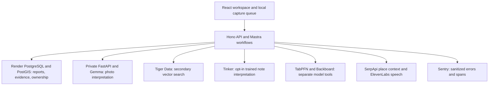

*This is a submission for the [Hacktoberfest Open-Source AI Challenge Week 1: Touch Grass](https://dev.to/challenges/hacktoberfest-week1-2026-10-05).*

## What I Built

FieldIssue gives you a reason to walk back to the same place: check whether something changed.

Take a photo of a broken bench, an overflowing bin or a damaged pavement. Add a short note and location. FieldIssue creates a report with an open-weight Gemma model's description. On your next walk, take another photo. The report keeps both observations and a comparison of the conditions that were added, removed or unchanged.

The important action is the revisit. A photo can document a problem; a dated sequence can help someone follow it through. The model can recommend a status, but a person must explicitly resolve the report.

That distinction also applies when the evidence is unhelpful. Uploading the same photo twice produces **“Repeated photo — no new evidence.”** It cannot establish that a repair happened.

The landing page introduces the idea; the separate workspace contains the map, reporting flow, saved walks, community coordination and Model Lab. The public demo needs no access token. Optional accounts preserve report ownership and private saved walks across devices. A private community can assign reports and request resolution review, which requires fresh compared evidence and two eligible member approvals. Those accounts are nicknames, not verified identities.

## Demo

**[Open FieldIssue](https://fieldissue-demo.onrender.com/) · [Explore reports](https://fieldissue-demo.onrender.com/app/explore) · [Model Lab](https://fieldissue-demo.onrender.com/app/lab)**

For a quick walkthrough:

1. Open [the public test report](https://fieldissue-demo.onrender.com/app/issues/FI-000005). Inspect its photos, repeated-photo safeguard and dated history. This is a labeled test record using a CC0 sample photo and synthetic coordinates at 0,0, not an actual field visit.
2. Play its saved ElevenLabs briefing. Open the Lab to inspect saved model outputs and their provenance.
3. To try the full journey, create your own report with a photo you can share publicly. Later, add a fresh revisit photo and compare it. Only the owner can use the ordinary resolution controls; visitors cannot resolve someone else's report.
4. Add nearby issues to a walk. Directions open in Google Maps after explicit location-sharing consent. The map's internal dotted lines are straight connections, not street routing.

*Hosted browser capture, 9 October. The report is an integration control, with its synthetic location and sample-photo origin visible. The screenshot includes controls available to that report's owner.*

The installable web app can keep photo captures locally when the server is unavailable. Upload happens only after review and consent. Maps and AI still need connectivity. Optional accounts add in-app reminders; calendar downloads work without promising email or push delivery.

The free Render service may need time to wake. Its current free primary database expires **7 November 2026**; preserving the demo beyond then requires an export or migration.

## Code

**[GitHub repository](https://github.com/himanshu748/fieldissue) · [MIT license](https://github.com/himanshu748/fieldissue/blob/main/LICENSE) · [Setup and demo guide](https://github.com/himanshu748/fieldissue/blob/main/DEMO.md)**

The repository began on 6 October 2026, within this challenge's window. Local fixture mode is clearly labeled and works without provider keys; the hosted demo uses real integrations. Fixtures do not masquerade as model inference.

## How I Built It

The frontend uses React, Vite, Tailwind, shadcn/ui, Motion and Leaflet. A TypeScript/Hono API runs typed Mastra observation and revisit workflows. A private FastAPI service handles intelligence work. Render hosts the application and authoritative PostgreSQL database; PostGIS serves location queries, while a separate Tiger Data pgvector index provides semantic search.

Model output is validated before persistence. Reports, observations and timeline events are written transactionally. Retrying an offline capture reuses its idempotency key so a lost response does not become a second report. Guest ownership attaches to an account inside the persistence transaction; the old guest cookie cannot bypass account ownership afterward.

The integrations have distinct jobs. Gemma reads photos. Tinker interprets the reporter's words. Backboard compares two open models. None of them independently closes an issue.

### What the training actually showed

Using Tinker, I fine-tuned Qwen3-8B on **36 synthetic field notes** for structured note interpretation, including informal multilingual input. On 18 held-out synthetic notes:

| Check | Base model | Fine-tuned model |
| --- | --- | --- |
| Valid output schema | 18/18 | 18/18 |
| Correct category | 17/18 | 17/18 |
| Correct severity | 13/18 | 17/18 |

That is a small improvement on a small invented dataset, not a real-world accuracy claim. The [evaluation is public](https://github.com/himanshu748/fieldissue/blob/main/docs/verification/tinker-evaluation-2026-10-09.json). The trained checkpoint is used by the live, consent-based note action. It receives no photos or coordinates, and its saved interpretation does not overwrite the report's classification or status. The current checkpoint expires on 8 November.

TabPFN is also a real API integration. Its separate scenario tester uses 96 synthetic training rows and eight numeric features. On 24 held-out rows, it scored **16/24 versus 17/24 for a majority baseline**. That result is why real-history walk ranking remains disabled. Users can inspect the synthetic example without being told it predicts their neighbourhood reliably.

*A real provider response to an invented scenario. The number is not a prediction for the public report above.*

### What broke during verification

Browser testing caught a saved-walk failure: the location picker sent display metadata to a strict API expecting coordinates. Stripping that metadata fixed the request; the browser then saved and reloaded the account's walk. This was a useful reminder to test the complete form, not just a valid API payload.

Sentry also helped separate an optional provider failure from a failed report. A test at 0,0 produced no nearby place through SerpApi, but the core Gemma report still saved. The [sanitized event evidence](https://github.com/himanshu748/fieldissue/blob/main/docs/verification/sentry-hosted-2026-10-08.json) records `PLACE_CONTEXT_UNAVAILABLE` and the responsible operation without exposing notes, photos or credentials. For training, [trace verification](https://github.com/himanshu748/fieldissue/blob/main/docs/verification/sentry-live-2026-10-07.json) records trace `5a4ee24fb1004d98850ffdfbc5ca9be7`: the root transaction and actual base/checkpoint sampling spans, observed after repairing timestamp sanitization.

The final runtime passed [240 automated tests](https://github.com/himanshu748/fieldissue/actions/runs/37893377754). Separate hosted checks verified account isolation, saved walks across sessions, membership revocation, map tiles, full audio playback and saved model results. [The acceptance ledger](https://github.com/himanshu748/fieldissue/blob/main/docs/verification/p2-acceptance-2026-10-09.md) distinguishes fresh provider calls from cached readbacks. Physical Android camera/GPS and an outdoor before/after visit still need independent verification; desktop tests do not establish either.

## Why Does Open Innovation Matter?

FieldIssue's comparison should be inspectable. A maintainer can read the prompts, check the output schema, reproduce the small evaluations and see where the models failed. Open weights also make the vision provider replaceable through the adapter, and let a specific task be fine-tuned and compared against its base model.

The application is MIT-licensed. Hosted providers retain their own terms; using an open-weight model does not make every service open source or permanently free. This build used free quotas and sponsor credits with bounded calls, saved results and no cash spending. Keeping the app useful also means accepting a negative evaluation result instead of putting it into walk recommendations.

## My Agent Session

Codex implemented backend work and performed integration and browser verification. Claude Opus implemented the frontend and later performed two source reviews of the P2 changes. Those reviews did not run the deployment or substitute for acceptance testing.

The Entire CLI captured the development session. [Checkpoint `01M4MS0B5PNB39JGA84HZTC0GH`](https://entire.io/gh/himanshu748/fieldissue/commit/e5c5ec14baafdc25c40b364c9678f1c181b1e264) shows a reviewed excerpt of actual Codex coding work and the committed synchronization verifier. Its session and View changes were verified in signed-out Safari Private Browsing. The earlier [reviewed excerpt of nine actual Claude messages](https://github.com/himanshu748/fieldissue/blob/main/docs/verification/entire-v2-curated-session.json) also remains public. Raw original agent logs remain private. The landing-page park illustration was generated with Codex and labeled as an illustration; it is never used as field evidence. This write-up was prepared with AI assistance.

## Prize Categories

Alongside overall consideration, these are the implemented partner integrations:

| Category | What to inspect |
| --- | --- |
| Best Use of Render | Hosted app, private intelligence service and authoritative PostgreSQL persistence. |
| Best Use of Gemma | Structured photo interpretation and revisit comparisons using an open-weight vision model. |
| Best Use of Tinker | Qwen3-8B fine-tuning, baseline comparison and the live trained-note action. |
| Best Use of TabPFN | Real API scenario tester and published evaluation; synthetic data only, below the majority baseline. |
| Best Use of Backboard | Saved Gemma 3 27B and Qwen2.5 72B comparisons through one API. |
| Best Use of ElevenLabs | Playable, cached field briefings generated from report text. |
| Best Use of Entire | Public checkpoint `01M4MS0B5PNB39JGA84HZTC0GH` with session and code diff, verified signed out. |
| Best Use of Mastra | Typed observation and revisit workflows around Gemma. |
| Best Use of Sentry Agent Tracing | Actual evaluation spans and sanitized failure diagnosis, with linked trace/event evidence. |
| Best Use of SerpApi | Nearby place context from live search, with optional failure handling. |
| Best Use of Tiger Data | Secondary pgvector semantic search, separate from the primary report database. |

TabPFN's example uses invented rather than historical observations; that limitation matters when assessing its category fit. Municipal integration is currently an Open311-style export, not automatic filing. The next evidence I want is a genuine outdoor revisit and human-labeled change history, so the product can be evaluated on the job it was built for.
